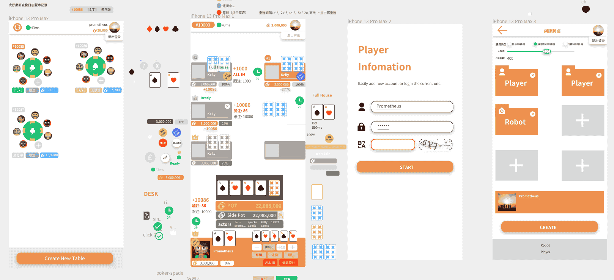
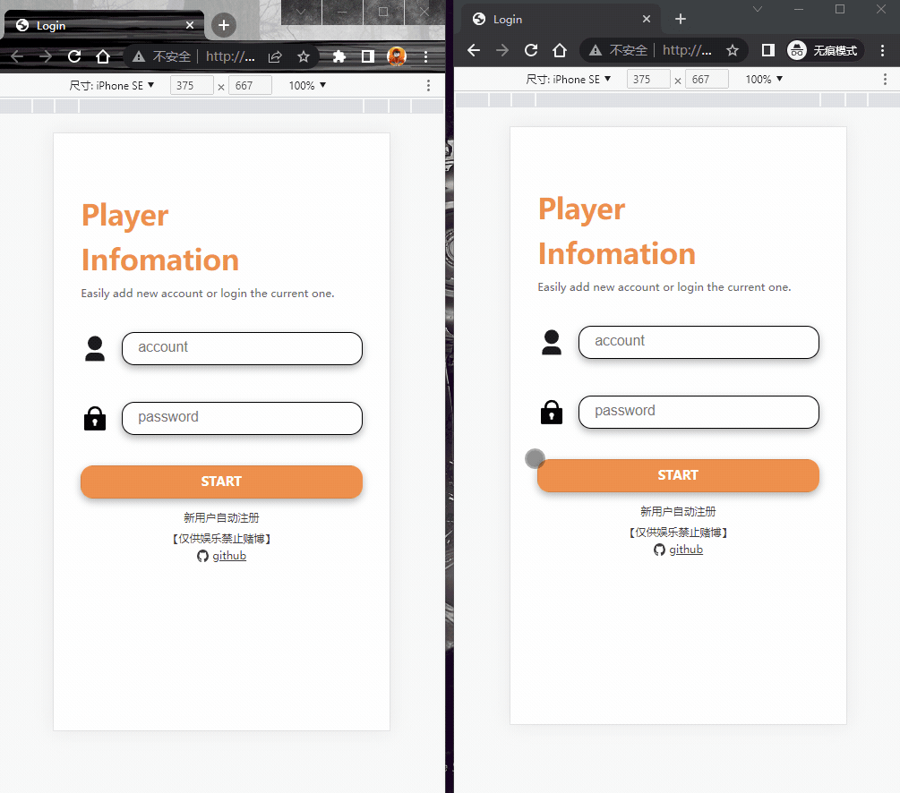

## 德州扑克后端，仅供技术实现参考，禁止赌博

### [H5前端工程](https://github.com/tangmingyou/texas-poker-front)

### 参考

[德州扑克Wiki](https://zh.wikipedia.org/zh-hans/%E5%BE%B7%E5%B7%9E%E6%92%B2%E5%85%8B)

[网易德州扑克规则](http://sports.163.com/special/poker_rule/?ivk_sa=1025883k)

### Todo List

- [x] 牌局结束后，清理离线玩家
- [x] 下注页面倒计时、超时自动操作
- [x] 创建新桌面时主动通知lobby界面刷新消息，自动拉取最新牌桌列表
- [ ] 无限注模式
- [ ] 流水记录查询
- [ ] 日志优化
- [ ] 验证码
- [ ] 性能测试
- [ ] 调优
  - [ ] 大厅桌面变化日志版本拉取
  - [ ] 注册同时生成大厅tiny头像
  - [ ] 客户端牌桌消息全量和增量拉取

Email: prometheustar@outlook.com
